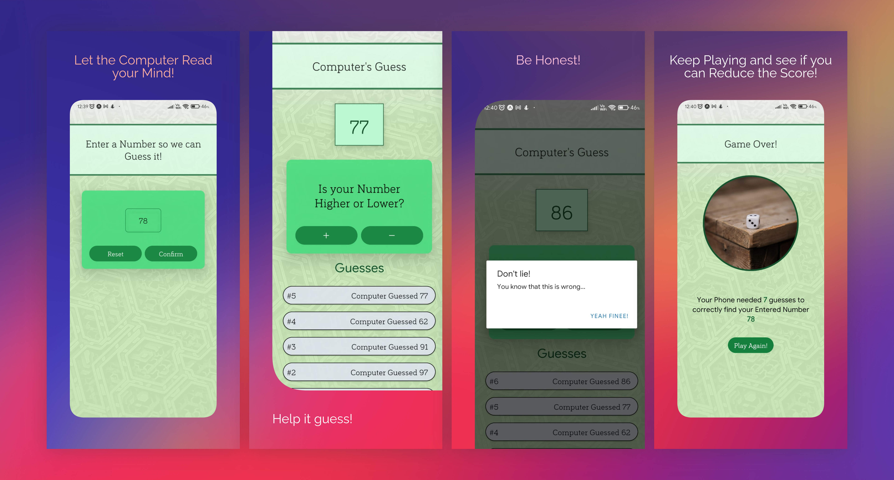

# What-my-no

A rather simple game made in React Native to guess a number, followed by a course.

# Screenshots

# Features

1. You can select a number and the computer will try to guess it.
2. You can view the previous guesses.
3. You can see how many guesses it took.

Thats pretty much it.

# How to Play

Just write a number and press the button. The computer will try to guess it. If it is too high, press the `LOWER` button, if it is too low, press the `HIGHER` button.

# Installation

Hopefully Ill publish the apk in the releases, you can download and install it from there. If not, you can clone the repo and run `npm install  && npm install --save-dev` and then `npm run start` to run it in your device.

# Credits

1. [React Native](https://reactnative.dev/)
2. [Expo](https://expo.dev/) and of course,
3. [Acade Mind React Native Course](https://pro.academind.com/p/react-native-the-practical-guide-2022-new)
